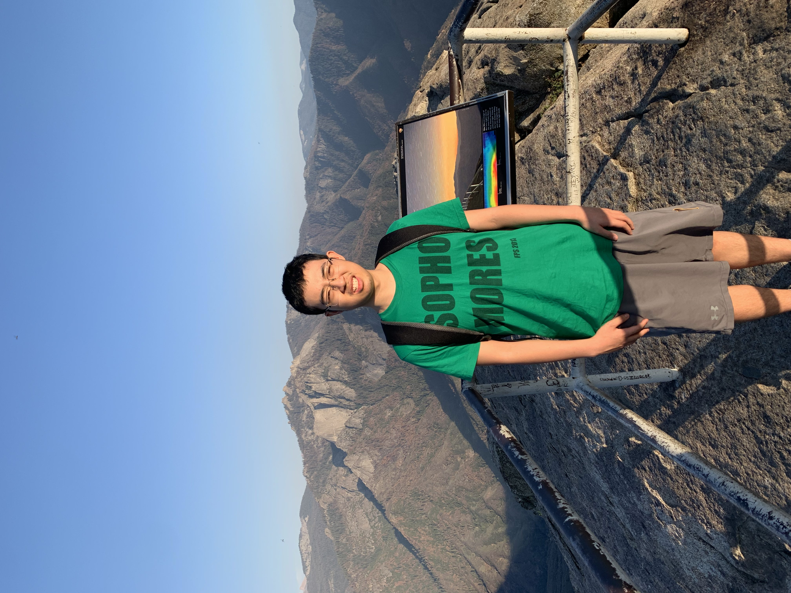
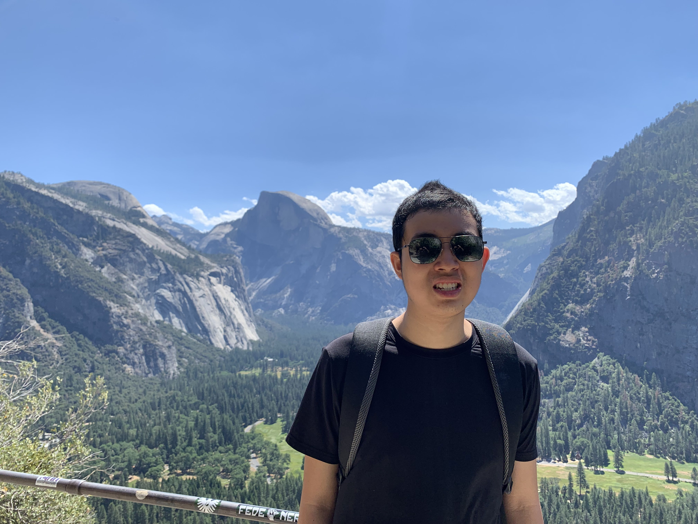
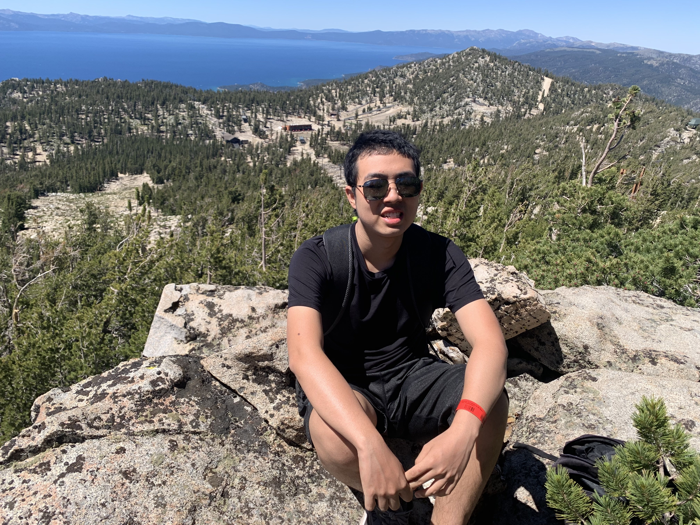

# Larry Mei

## About me
I am a **second year** student at **University of California, San Diego** majoring in **computer science**. I'm currently most interested in *machine learning* and *computer vision*. I also like to [travel](#pictures) and go to national parks with my family.
## Links
[GitHub](https://github.com/lmeiucsd)

[Linkedin](https://www.linkedin.com/in/larry-mei-708882247/)
> my Linkedin is not updated

Email: lmei@ucsd.edu

## Technologies
Here are the languages I am most to least familiar with, in an ordered list:
1. Python
2. Java
3. C++
4. C
5. Kotlin
6. HTML/CSS
7. JavaScript

Here are frameworks I am familiar with, in an unordered list:
- React
- NodeJS
- TensorFlow
- PyTorch

## Pictures

## Accomplishments
I know how to [reverse a linked list](reverse.md)

## WIP
- [x] Pictures
- [x] Headings
- [x] Styling text
- [x] Quoting text
- [x] Quoting code
- [x] External Links
- [x] Section links
- [x] Relative Links
- [x] Ordered and Unordered Lists
- [x] Task lists

